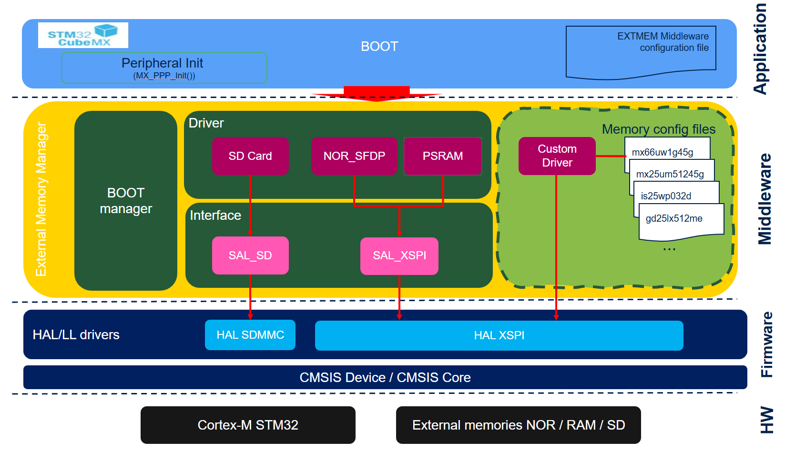

# Release Notes for
# <mark>STM32_ExtMem_Manager</mark>
Copyright &copy; 2024 STMicroelectronics\

# Purpose

The source code delivered is a middleware to manage different types of external memory.

The STM32_ExtMem_Manager component provides SW implementation that facilitates external memories integration.

It supports Serial Flash Discovery Parameters (JEDEC SFDP, aligned with JEDEC standard JESD216F.02) to facilitate serial NOR Flash integration.

Thanks to STM32_ExtMem_Manager's high scalability, support of multiple external memory types(NOR, RAM, SD) and interface types (XSPI, SDMMC, FMC) becomes easier.

Here is the list of references to user documents:

- [WIKI Page](https://wiki.st.com/stm32mcu/wiki/Introduction_to_External_memory_Manager): Introduction to External Memory Manager
- [WIKI Page](https://wiki.st.com/stm32mcu/wiki/Getting_started_with_External_memory_Manager_and_External_memory_loader): Getting started with External Memory Manager

# Update History

<label for="collapse-section7" aria-hidden="true">__V1.6.0 / 18-May-2026__</label>

## Release update

  - Add RR, RRR and WWW configuration step operation types in CUSTOM driver
  - Add user callback management capability in EMM Custom configuration steps (CUSTOM driver)
  - Allow 16 bit data parameters in PSRAM configuration steps for Register configuration
  - Allow Write only operations in memory configuration registers (PSRAM driver)
  - Ensure correct data length is used when reading/writing register in DTR mode (SAL XSPI services)
  - Correct value of WIP polarity when extracted from Word 14 of JEDEC_Basic.Params table analysis (NOR_SFDP driver)
  - Add Custom configuration files limited to 50 Mhz (provided as examples for easy bring ups)
  - Add support of __Macronix MX25R6435F__, __Macronix MX25LM51245G__ and __Winbond W25Q16JV__ in NOR_SFDP driver + Add corresponding configuration files for CUSTOM driver
  - Add support of __APMemory APS6408L-OBMx DDR Octal SPI PSRAM__ in PSRAM driver + Add corresponding configuration file for Custom driver
  - Add support of HyperRam memories in CUSTOM driver + Add corresponding configuration files for __ISSI IS66WVH8M8__, __Winbond W956D8MB__ and __Winbond W958D6NB__ HyperRAM references
  - Add support of configuration file for __Winbond W35T51NW__ PSRAM reference
  - Add support of EXTMEM_WriteInMappedMode in Custom Driver
  - Add support of Dual Memory configurations
  - Prevent double XSPI Deinit
  - HyperRam support in Custom driver
  - Psram support update in Custom driver
  - Solving of MCUAstyle warnings
  - Remove useless code in SAL_XSPI_GetId()
  - Update Doxygen notes
  - Solving of compilation warnings in trace system in Custom driver under STM32CubeIDE
  - Addition of a debug option for skipping loading of the Appli from the external Flash in the load and run mode.

## Known limitations

 - See supported memories

## Supported memories

 - List of the tested memories (per selected EMM driver type)
   - NOR_SFDP :
      - MACRONIX : MX66UW1G45G, MX25UW25645G, MX25LM51245G, __MX25R6435F (new)__
      - WINBOND : W25Q64JV
      - ISSI : IS25WP032D, IS25LP032D
   - CUSTOM (configuration files provided) :
      - MACRONIX : MX66UW1G45G, MX25UW25645G, MX25UM51245G, __MX25LM51245G (new)__, __MX25R6435F (new)__
      - ISSI : IS25WP032D, __IS66WVH8M8 (new)__
  	  - APMEMORY APS256XXN-OBR-BG
  	  - WINBOND : __W25Q16JV (new)__, __W35T51NW (new)__, __W958D6NB (new)__, __W956D8MB (new)__
   - PSRAM : APMEMORY APS256XXN-OBR-BG, __APS6408L (new)__
   - SDCARD : Micro SD kingstone 1GB

## Supported Devices and boards

- Not applicable

## Backward Compatibility

- Not applicable

## Dependencies

- Not applicable

<label for="collapse-section6" aria-hidden="true">__V1.5.0 / 10-Sep-2025__</label>

## Release update

  - Solve EMM Initialisation issues with Macronix MX25L25645G QSPI memory
  - Correct number of dummy cycles used in 1S1S1S reading on Octal MX66
  - Check number of dummy cycles to be used in Octal mode for READ SFDP command
  - Adapt the memory interface frequency according to max requested frequency as defined in configuration table in Octal mode
  - Correct initialisation of nb of dummy cycles in some cases of 4 lines configuration
  - Handle case where MaxFreq is undefined in NOR SFDP extmem_list_config
  - Codespell and MCUAstyle corrections
  - Add DCache management in EXTMEM_DRIVER_NOR_SFDP_WriteInMappedMode() in Nor Flash driver
  - Addition of a new EMM driver type : CUSTOM driver allows end user to handle memories thanks to a configuration file containing all required memory characteristics, register configuration step descriptions, ... Examples of configuration files used with this CUSTOM driver are provided.
  - Refactoring of code comments

## Known limitations

 - See supported memories

## Supported memories

 - List of the tested memories (per selected EMM driver type)
   - NOR_SFDP :
      - MACRONIX MX66UW1G45G, MX25UW25645G, MX25LM51245G
      - WINBOND  W25Q64JV
      - ISSI     IS25WP032D, IS25LP032D
  	  - GIGADEVICES   GD25LX512ME, GD55LX01GE
   - CUSTOM (configuration files provided) :
      - MACRONIX MX66UW1G45G, MX25UW25645G, MX25UM51245G
      - ISSI     IS25WP032D
  	  - APMEMORY APS256XXN-OBR-BG
   - PSRAM: APMEMORY APS256XXN-OBR-BG
   - SDCARD: Micro SD kingstone 1GB

## Supported Devices and boards

- Not applicable

## Backward Compatibility

- Not applicable

## Dependencies

- Not applicable

<label for="collapse-section5" aria-hidden="true">__V1.4.0 / 27-May-2025__</label>

## Release update

  - Update of Nor SFDP friver for support of GigaDevices memories (GD25LX512ME, GD55LX01GE)
  - Update of Nor SFDP friver for support of ISSI Quad memories (IS25WP032D)
  - Correction in QSPI enabling procedure for 0x04 method (QE is bit 1 of status register 2)
  - Correction of typographical errors
  - WIP flag check executed just after DTR octal mode entry should be executed in Octal mode

## Known limitations

 - See supported memories

## Supported memories

 - List of the tested memories
   - NOR_SFDP :
      - MACRONIX MX66UW1G45G, MX25UW25645G, MX25LM51245G
      - WINBOND  W25Q64JV
      - ISSI     IS25WP032D, IS25LP032D
	  - GIGADEVICES   GD25LX512ME, GD55LX01GE
   - PSRAM: APMEMORY APS256XXN
   - SDCARD: micro SD kingstone 1GB

## Supported Devices and boards

- Not applicable

## Backward Compatibility

- Not applicable

## Dependencies

- Not applicable

<label for="collapse-section4" aria-hidden="true">__V1.3.0 / 17-December-2024__</label>

## Release update

  - doc : code comment update

## Known limitations

 - See supported memories

## Supported memories

 - List of the tested memories
   - NOR_SFDP :
      - MACRONIX MX66UW1G45G, MX25UW25645G, MX25LM51245G
      - WINBOND  W25Q64JV
   - PSRAM: APMEMORY APS256XXN
   - SDCARD: micro SD kingstone 1GB

## Supported Devices and boards

- Not applicable

## Backward Compatibility

- Not applicable

## Dependencies

- Not applicable

<label for="collapse-section3" aria-hidden="true">__V1.2.0 / 09-October-2024__</label>

## Release update

  - fix : jump issue without compiler optim
  - fix : performance issue detected in security context

## Known limitations

 - See supported memories

## Supported memories

 - List of the tested memories
   - NOR_SFDP :
      - MACRONIX MX66UW1G45G, MX25UW25645G, MX25LM51245G
      - WINBOND  W25Q64JV
   - PSRAM: APMEMORY APS256XXN
   - SDCARD: micro SD kingstone 1GB

## Supported Devices and boards

- Not applicable

## Backward Compatibility

- Not applicable

## Dependencies

- Not applicable

<label for="collapse-section2" aria-hidden="true">__V1.1.0 / 29-May-2024__</label>

## Release update

  - NOR_SFDP :
    - update for memory presenting only short basic JEDEC table
    - update to add frequency upgrade when JEDEC doesn't provide frequency information
	- fix issue detected during octal activation requiring adding WIP operations
  - SAL_XSPI :
    - update to support DMA transfer

## Known limitations

 - See supported memories

## Supported memories

 - List of the tested memories
   - NOR_SFDP :
      - MACRONIX MX66UW1G45G, MX25UW25645G, MX25LM51245G
      - WINBOND  W25Q64JV
   - PSRAM: APMEMORY APS256XXN
   - SDCARD: micro SD kingstone 1GB

## Supported Devices and boards

- Not applicable

## Backward Compatibility

- Not applicable

## Dependencies

- Not applicable

<label for="collapse-section1" aria-hidden="true">__V1.0.0 / 28-February-2024__</label>

## First release

  First official release of STM32_ExtMem_Manager

## Known limitations

 - List of the tested memories
   - NOR_SFDP : MACRONIX MX66UW1G45G, MX25UW25645G
   - PSRAM: APMEMORY APS256XXN
   - SDCARD: micro SD kingstone 1GB

## Supported Devices and boards

- Not applicable

## Backward Compatibility

- Not applicable

## Dependencies

- Not applicable

<abbr title="Based on template cx566953 version 2.1">Info</abbr>